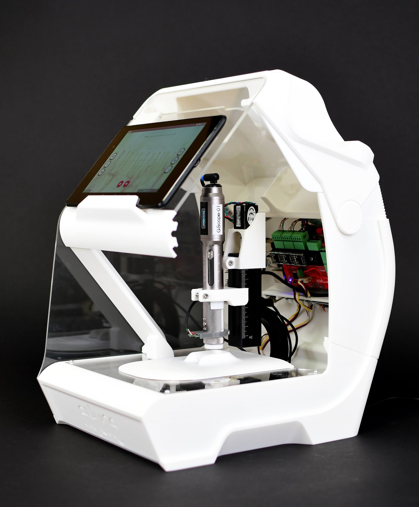
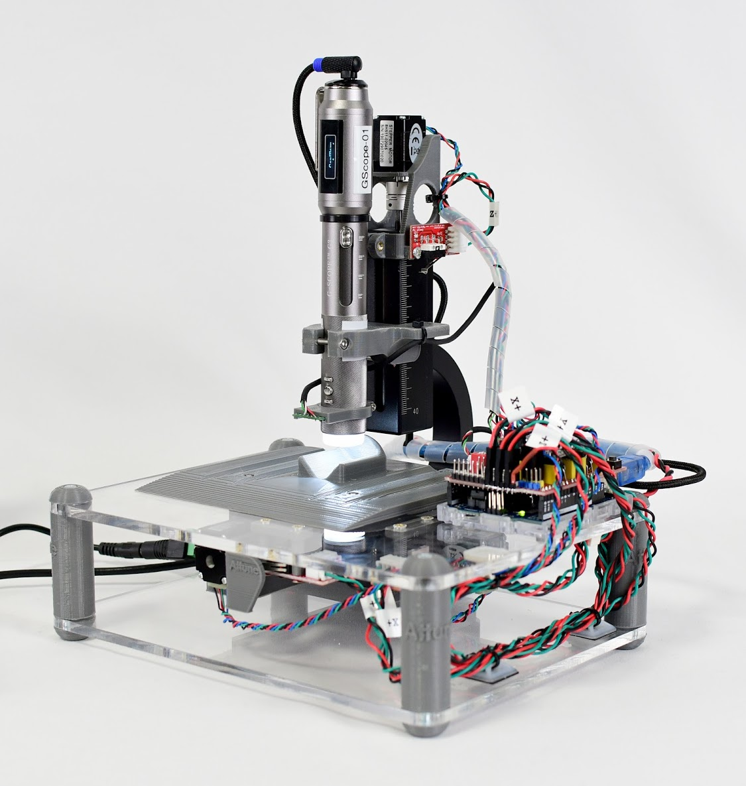

# Project Attune 🔬👆

## Welcome to project Attune
For deatield documentation and instructions see the [WiKi](https://github.com/dlx-designlab/Attune/wiki/Scan-Sations)
## About the project
Attune is a collaborative international research and development project,
carried out by scientists and designers, that focuses on a groundbreaking idea
for the self-monitoring of personal health. The collaboration was initiated in
February 2019, and it is based to a large extent on research in the field of
capillaroscopy by Professor Yukiko Matsunaga and her lab.
Attune’s long-term goal is to create an innovative, everyday health monitoring
device that will enable people to monitor their health status on a daily basis
through simple and non-invasive nailfold capillary observation. The Attune
device will diagnose a person’s “wellness” status and facilitate optimum health
behaviour, both physical and mental. The device will be highly engaging and
rewarding to use and interact with, and this will motivate people to use it
regularly to maintain good health.

## Project collaborators
- [Y.Matsunaga Lab](http://www.matlab.iis.u-tokyo.ac.jp/)
- [The University of Tokyo DLX Design Lab](https://www.designlab.ac/)
- [Y.Sato Lab](https://www.ut-vision.org/sato-lab/)
- [Bezalel Academy of Art and Design, Jerusalem](https://www.bezalel.ac.il/).

## Our Latets Prototypes
The Jetscope:

Alpha Version:
